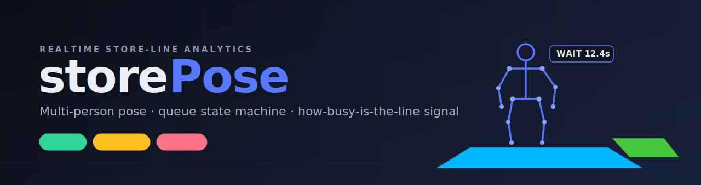
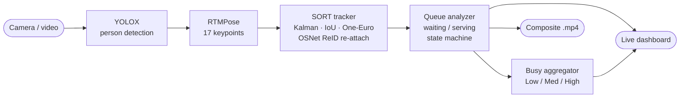
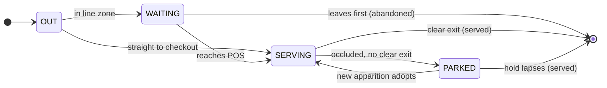
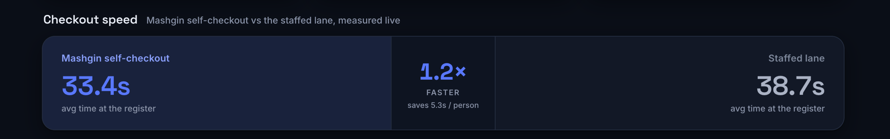
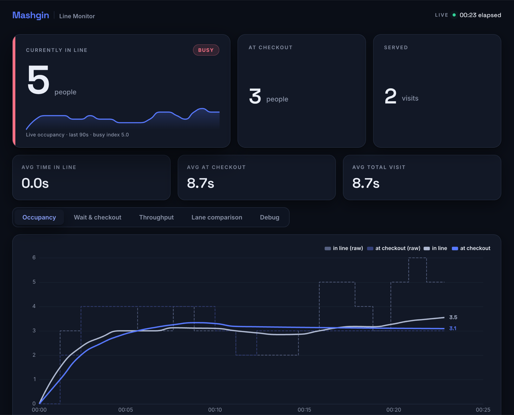
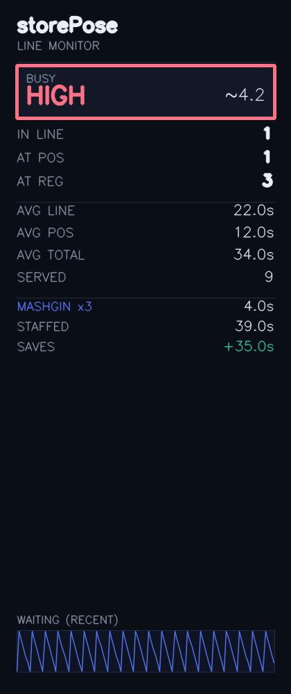

<p align="center">
  
</p>

<p align="center">
  
  
  
  
</p>

**storePose** turns ordinary store-camera video into a live answer to one operational
question — **how busy is the checkout line, right now?** — and into a measured
**comparison between a Mashgin self-checkout and a staffed lane**.

It detects every person, fits a 17-keypoint pose, tracks each one with a stable
identity through occlusions, and runs a per-person state machine that splits a
visit into *waiting in line* and *being served*. From that it derives a stable
**Low / Medium / High** busy signal, per-checkout service times, and a live
browser dashboard — all on a laptop, in realtime, with no `mmcv`/`mmpose` build
pain (pose runs on [`rtmlib`](https://github.com/Tau-J/rtmlib) + ONNX Runtime).

---

## Highlights

- **Realtime multi-person pose** — YOLOX person detection + RTMPose 17-keypoint
  skeletons, top-down (one pose pass per person).
- **Stable identities** — SORT-style Kalman + IoU tracking, One-Euro keypoint
  smoothing, and learned-embedding (OSNet ReID) **re-identification** that
  re-attaches a returning person to their original id, even after a full exit
  and re-entry.
- **Queue state machine** — per-person `OUT → WAITING → SERVING → done`, with a
  bystander/walk-through filter so only people who actually *stop* are counted.
- **"How busy is the line?"** — a calibrated, hysteresis-stabilized
  **Low/Medium/High** label per 10-minute window from a robust occupancy
  statistic.
- **Checkout comparison** — Mashgin self-checkout vs the staffed lane, with
  **kiosk-count normalization** (`--num-mashgins`) and **occlusion-tolerant
  re-assignment** so one occluded serve isn't miscounted as two.
- **Live dashboard** — a Next.js web app served by the Python process (no Node at
  runtime) with a live annotated video feed plus occupancy, wait/serve,
  throughput, and a Mashgin-vs-staffed speed strip.
- **Composite recording** — save a single `.mp4` with the annotated video on the
  left 3/4 and the live dashboard panel on the right 1/4.
- **Privacy by default** — every face is pixelated (localized from the face
  keypoints, falling back to the top of the box) in the live view, recordings,
  and debug frames; opt out with `--no-blur-faces`.
- **Reproducible & tested** — 375 unit tests; every feature has a design spec in
  [`docs/superpowers/specs/`](docs/superpowers/specs).

## Pipeline



Each stage has one job and a clean interface; the detector and pose models are
injectable, so the pipeline and analysis logic are unit-tested without weights.

---

## Quickstart

Requires [`uv`](https://docs.astral.sh/uv/) (`brew install uv`).

```bash
uv sync                                   # Python 3.12 venv + deps
uv run python main.py                     # default webcam, balanced, CoreML
uv run python main.py --source videos/clip.mp4   # run on a file
```

Models (~140 MB) download to `~/.cache/rtmlib` on first run. Press **`q`** or
**Esc** in the window to quit.

The fastest path to a fully-configured camera view — draw zones, calibrate the
busy bands, and launch — is a single command:

```bash
./view-setup.sh -v videos/clip.mp4        # zones → calibrate → run + dashboard
```

It writes a reusable `viewscripts/<clip>.sh`. Launch saved views later from an
arrow-key menu:

```bash
./video-run.sh                            # interactive launcher (scroll, toggle, Enter)
```

> A complete, copy-paste walkthrough lives in **[`docs/usage.md`](docs/usage.md)**.

---

## Watching a line

Define the line and checkout areas once per fixed camera, then storePose tracks
each visit through them. The interactive editor draws all zones in one session
(`1` line, `2` Mashgin POS, `3` non-Mashgin lane, `4` censor/blur region; `n` new
contour, `s` save):

```bash
uv run python main.py --define-zone --source videos/clip.mp4
uv run python main.py --source videos/clip.mp4 \
    --zone zones/clip.json --pos-zone zones/clip_pos.json --wait-log waits.csv
```

A person is **in-zone** by an OR of two signals — the visible-ankle midpoint
inside the polygon, *or* their foot-region box coverage — so a held position
isn't lost when feet leave frame or an ankle drifts out. People walking *through*
a zone are rejected by a directional **transit filter**; only people who stop are
counted. Each visit flows through:



Time is attributed to whichever state the person is in each frame; gaps where a
track is briefly lost (and re-identified) are credited to the state held when it
disappeared. Completed visits are logged as
`id, entered_s, exited_s, wait_seconds, serving_seconds, outcome, rejected`.

### Identity & re-id

Frame-to-frame, a SORT core (Kalman motion + IoU) keeps each person on one id.
When a track is lost — occlusion, or a full walk-out of frame — it is not deleted
but moved to a TTL-bounded **lost gallery** (`--reid-seconds`). On reappearance,
any detection the IoU step left unmatched is re-attached to a lost track by
**appearance**: a learned **OSNet ReID embedding** (a 512-d descriptor per
person), matched by nearest-neighbour against a small gallery of that track's
recent embeddings rather than a single average — so a person seen from several
angles still matches. Brief in-frame losses keep a spatial gate; a full exit
drops it (appearance-only, at a stricter threshold), so someone can leave and
re-enter **anywhere** in frame and reclaim their id. The result is one person =
one id, which is what keeps arrival counts and per-person wait timers honest.

Backends are swappable via `--reid-backend`: `osnet-x025` (default; a 0.9 MB
MSMT17 ONNX, auto-downloaded once to `~/.cache/storepose/reid/`), `osnet-x1`
(more accurate, weights not yet bundled), or `histogram` (a dependency-free HSV
colour fallback). `--no-reid` turns re-attach off entirely. In the launcher TUI,
the `reid` column cycles these per view.

### Occlusion-tolerant checkout re-assignment

At a busy checkout a served person is often occluded and their track dropped — a
naive tracker then mints a *second* serve when they reappear. storePose instead
**parks** a serve that vanishes without a clear exit and lets the next apparition
in the same checkout (within a time + spatial gate) **adopt** it and continue the
timer, so one real serve stays one record. Enabled for the non-Mashgin lane by
default (`--pos-reassign-seconds`, `0` to disable); `--pos-reassign-mashgin`
extends it to Mashgin.

---

## How busy is the line?

storePose answers the headline question as a stable **Low / Medium / High** label
per **10-minute window**, by aggregating the noisy per-frame waiting count into a
robust, time-weighted statistic (90th-percentile occupancy by default) and
mapping it to a band. Two stabilizers keep it from flickering: two-level
sub-window smoothing (`--busy-subwindow`) and a cross-window deadband
(`--busy-hysteresis`).

```bash
# live: on-screen badge + per-window report at exit
uv run python main.py --source videos/clip.mp4 --zone zones/clip.json --busy-log busy.csv

# offline: wait log → per-window labels; hand-label truth; score predictions
uv run python busy_report.py aggregate waits.csv --window 600 -o busy.csv
uv run python busy_report.py label videos/clip.mp4 -o truth.csv --window 600
uv run python busy_report.py eval busy.csv truth.csv
```

Band thresholds are **calibrated per view** from the clip's own occupancy
distribution — no hand-tuned magic numbers:

```bash
uv run python main.py --calibrate --source videos/clip.mp4 --zone zones/clip.json
# → writes calib/clip.json; runs auto-load it. (view-setup.sh does this for you.)
```

> The precise Low/Medium/High definition, the alternatives weighed (occupancy vs.
> parties vs. wait-time), and the evaluation protocol are in
> **[`docs/problem-definition.md`](docs/problem-definition.md)**.

---

## Mashgin vs. the staffed lane

With a non-Mashgin checkout zone defined, the dashboard surfaces a live
service-speed comparison. Because several Mashgin kiosks run in parallel,
`--num-mashgins N` divides the Mashgin per-customer time (and the
faster-multiplier / saves-per-person) by `N` to reflect the system's real
throughput against a single staffed lane.

<p align="center">
  
</p>

---

## Live dashboard & recording

Every run serves a live dashboard on localhost (default
`http://127.0.0.1:8000/`, auto-opened in your browser). It streams a **live
annotated video feed** — person boxes, COCO-17 skeletons, and zone polygons drawn
as an SVG overlay that interpolates between frames — next to occupancy, wait/serve
moving averages, throughput, the busy badge, and the checkout-speed strip. On a
file source the timeline is video time; on a webcam it is real time. Disable with
`--no-dashboard`.

The UI is a **Next.js app** (`web/`) exported to static files and served by the
Python process itself — no Node runtime at display time. The interactive launcher
builds it for you when needed:

```bash
./video-run.sh        # builds web/out if stale, then launches and opens the browser
```

Running `main.py` directly serves the built dashboard when `web/out` exists;
if it doesn't, the server falls back to a self-contained legacy HTML page (no
crash). To build it once by hand, or to iterate on the UI with hot-reload:

```bash
cd web && npm install && npm run build   # one-time / after UI edits → web/out
cd web && npm run dev                     # hot-reload on :3000, proxies /metrics+/stream to :8000
```

<p align="center">
  
</p>

`--save-mp4` records the run as a single composite — annotated video on the left
3/4, the live dashboard panel on the right 1/4 — auto-named into `runs/`:

<p align="center">
  
</p>

```bash
uv run python main.py --source videos/clip.mp4 --zone zones/clip.json --busy --save-mp4
# → runs/clip_<timestamp>.mp4   (left: annotated video · right: dashboard panel)
```

Faces are pixelated by default in both the recording and the live window —
localized from the COCO-17 face keypoints when visible, else the top quarter of
the person box. Disable with `--no-blur-faces`.

---

## Performance

Measured on an Apple M5 Max (`balanced` mode). Top-down pose runs once per person,
so framerate scales with the number of people in frame:

| Device       | Detector | Pose / person | 1 person | 3 people |
|--------------|----------|---------------|----------|----------|
| `mps` CoreML | ~18 ms   | ~4 ms         | ~45 fps  | ~32 fps  |
| `cpu`        | ~156 ms  | ~14 ms        | ~6 fps   | ~5 fps   |

CoreML is ~8× faster here — keep the default `--device mps` for realtime, and
`--mode lightweight` for higher framerates in crowded scenes.

---

## CLI reference

Most-used flags:

| Flag | Default | Description |
|------|---------|-------------|
| `--source` | `0` | Webcam index (numeric) or path to a video file. |
| `--mode` | `balanced` | `lightweight` \| `balanced` \| `performance`. |
| `--device` | `mps` | `mps` (CoreML) or `cpu`. |
| `--zone` / `--pos-zone` / `--alt-zone` | — | Line / Mashgin POS / non-Mashgin checkout zone JSON. |
| `--define-zone` | — | Launch the interactive zone editor and exit. |
| `--busy` | — | Live Low/Medium/High busy badge (needs `--zone`). |
| `--calibrate` / `--calib PATH` | — | Infer busy bands from the clip / load a calib file. |
| `--num-mashgins` | `1` | Parallel Mashgin kiosks; normalizes the checkout comparison. |
| `--save-mp4` | — | Record a composite video+dashboard `.mp4` into `runs/`. |
| `--debug` | — | Frame-by-frame scrub with per-person reasoning in the dashboard. |
| `--no-dashboard` | — | Disable the live web dashboard. |

<details>
<summary><b>Full flag reference</b></summary>

| Flag | Default | Description |
|------|---------|-------------|
| `--source` | `0` | Webcam index, or path to a video file. |
| `--mode` | `balanced` | `lightweight` \| `balanced` \| `performance`. |
| `--device` | `mps` | `mps` (CoreML) or `cpu`. |
| `--det-conf` | `0.7` | Person-detection confidence threshold. |
| `--det-overlap` | `0.8` | Drop a box more than this fraction inside a larger one. |
| `--kpt-thr` | `0.5` | Keypoint confidence threshold for drawing. |
| `--conf` | — | Overlay each person's detector confidence. |
| `--no-fps` | — | Hide the FPS overlay. |
| `--no-blur-faces` | — | Disable face pixelation (on by default). |
| `--save PATH` | — | Write annotated output to this `.mp4` path. |
| `--save-mp4` | — | Auto-name a composite video+dashboard `.mp4` into `runs/`. |
| `--no-track` | — | Disable tracking; raw per-frame detections. |
| `--hold-seconds` | `1.5` | How long a lost person's box keeps coasting. |
| `--min-hits` | `3` | Detections before a track is confirmed/drawn. |
| `--iou-thr` | `0.3` | Min IoU to associate a detection to a track. |
| `--max-overlap` | `0.5` | Drop a coasting ghost overlapping another box by more than this. |
| `--no-reid` | — | Disable appearance re-id. |
| `--reid-seconds` | `10.0` | How long a lost track stays re-attachable. |
| `--reid-backend` | `osnet-x025` | Re-id appearance backend: `osnet-x025` (fast), `osnet-x1` (accurate), or `histogram`. |
| `--reid-weights` | — | Local OSNet ONNX file overriding the auto-downloaded weights. |
| `--reid-thr` | per-backend | Appearance similarity floor for re-attach (osnet 0.5, histogram 0.6). |
| `--no-smooth` | — | Disable One-Euro keypoint smoothing. |
| `--smooth-cutoff` / `--smooth-beta` | `1.0` / `0.007` | One-Euro filter parameters. |
| `--zone` | — | Queue-zone JSON; enables waiting-in-line detection. |
| `--define-zone` | — | Launch the interactive zone editor and exit. |
| `--pos-zone` | — | Mashgin POS zone; splits line time into waiting vs serving. |
| `--define-pos-zone` | — | Editor for the POS zone, then exit. |
| `--alt-zone` | — | Non-Mashgin checkout zone; enables the comparison. |
| `--define-alt-zone` | — | Editor for the non-Mashgin checkout, then exit. |
| `--blur-zone` | — | Censor-zone JSON; pixelate these regions in the live view, recording, and browser feed. |
| `--define-blur-zone` | — | Editor for the censor/blur zone, then exit. |
| `--no-alt` | — | Ignore the alt zone even if set (too-occluded staffed lane). |
| `--wait-enter-frames` | `5` | Consecutive in-zone frames before WAITING. |
| `--pos-enter-frames` | `3` | Consecutive in-POS frames before SERVING. |
| `--transit-speed` | `0.4` | Reject walk-throughs above this directional speed; `0` disables. |
| `--transit-window` | `1.0` | Trailing window (s) for transit displacement. |
| `--wait-exit-seconds` | `2.0` | Out-of-condition time before WAITING ends. |
| `--zone-coverage` | `0.5` | Foot-region fraction inside the zone when ankles are occluded. |
| `--zone-foot-band` | `0.3` | Bottom fraction of the box used as the foot region. |
| `--wait-min-dwell` | `0.0` | Min in-zone dwell (s) before counting; rejects pass-by bystanders. |
| `--min-wait` | `5.0` | Min real visit time (s); shorter visits are flagged `rejected`. |
| `--pos-reassign-seconds` | `20.0` | Hold window for an occluded checkout serve; `0` disables. |
| `--pos-reassign-mashgin` | — | Also apply occlusion re-assignment to Mashgin. |
| `--wait-log PATH` | — | Append completed visits to this CSV. |
| `--reject-short` | — | Flag implausibly short visits as `rejected`. |
| `--reject-floor` / `--reject-frac` / `--reject-warmup` | `2.0` / `0.25` / `10` | Outlier-visit thresholds. |
| `--busy` | — | Live Low/Medium/High badge (needs `--zone`). |
| `--busy-log PATH` | — | Per-window busy report CSV at exit (implies `--busy`). |
| `--busy-window` | `600` | Busy aggregation window, seconds. |
| `--busy-subwindow` | `0.0` | Two-level smoothing sub-window, seconds; `0` = off. |
| `--busy-metric` | `occupancy_p90` | Window feature driving the label. |
| `--busy-low-max` / `--busy-medium-max` | `1.0` / `3.0` | Manual band bounds (else calibrate). |
| `--busy-hysteresis` | `0.0` | Cross-window deadband to suppress label flapping. |
| `--busy-live-window` | `30.0` | Trailing seconds the live badge summarizes. |
| `--calibrate` | — | Infer busy bands from `--source` → `calib/<stem>.json` (needs `--zone`). |
| `--calib PATH` | — | Load calibrated bands; overrides manual `--busy-*-max`. |
| `--busy-strategy` | — | Override the calibrated band set (`skewed`/`thirds`/`peak`). |
| `--num-mashgins` | `1` | Parallel Mashgin kiosks; normalizes the checkout comparison. |
| `--no-dashboard` | — | Disable the live web dashboard. |
| `--dashboard-port` | `8000` | Port for the live dashboard server. |
| `--debug` | — | Frame-by-frame scrub; per-person reasoning in the dashboard. |
| `-v`, `--verbose` | — | Show a preview window during `--calibrate`. |

</details>

---

## Repository layout

```
main.py             CLI entrypoint (run / define-zone / calibrate)
busy_report.py      offline busy tooling: aggregate · label · eval
view-setup.sh       one-shot: draw zones → calibrate → write viewscript → run
video-run.sh        arrow-key launcher for saved views (curses)
src/storepose/
  config.py         AppConfig + CLI parsing/validation
  pipeline.py       PosePipeline.process(frame) → FrameResult
  detector.py       PersonDetector (YOLOX) · pose.py  PoseEstimator (RTMPose)
  runner.py         capture → process → track → analyze → annotate → display/record
  drawing.py        skeleton / box / zone / busy-badge overlays
  video_source.py   VideoSource (webcam | file)  · video_sink.py  VideoSink (.mp4)
  tracking/         SORT tracker: assignment, kalman, smoothing, track, appearance (histogram/osnet + reid_zoo)
  queue/            zone, analyzer (waiting/serving + occlusion re-assignment), editor
  busy/             occupancy timeline, aggregator, per-view calibration, report
  dashboard/        localhost server, SSE video stream, metrics, recorded panel
  launcher.py       curses launcher  · launcher_core.py  (pure, testable model)
  eval/             ordinal metrics + ground-truth labeling helpers
web/                Next.js dashboard UI (static export served by the Python server)
scripts/
  chunk_video.py    split a long video into fixed-size partNN.mp4 chunks
docs/
  usage.md          copy-paste walkthrough
  problem-definition.md   the "how busy" definition + evaluation plan
  superpowers/specs/      one design doc per feature
```

## Testing

```bash
uv run pytest          # 375 tests
```

Every feature is developed test-first against a written spec; the specs in
[`docs/superpowers/specs/`](docs/superpowers/specs) double as the design record.

## Built on

- **[rtmlib](https://github.com/Tau-J/rtmlib)** — ONNX Runtime inference for
  RTMPose / YOLOX, no `mmcv`/`mmpose` build.
- **[RTMPose](https://arxiv.org/abs/2303.07399)** (Jiang et al., 2023) — top-down
  pose estimation.
- **[YOLOX](https://arxiv.org/abs/2107.08430)** (Ge et al., 2021) — person
  detection.
- **SORT** (Bewley et al., 2016) — Kalman + IoU tracking.
- **[1-Euro filter](https://gery.casiez.net/1euro/)** (Casiez et al., 2012) —
  low-latency keypoint smoothing.
